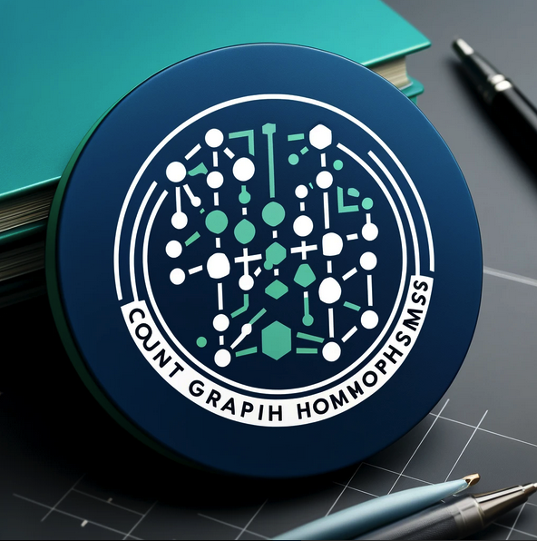

# count-graph-hom: Yes we count!



**Caption**: DALL-E is not good at spelling...

The `count-graph-hom` library is the first ever:tm: 100%-[SageMath](https://www.sagemath.org/)-compatible implementation of the homomorphism counting algorithm from "[Homomorphisms Are a Good Basis for Counting Small Subgraphs](https://arxiv.org/abs/1705.01595)" by Radu Curticapean, Holger Dell, and Dániel Marx.

The library is designed to be efficient, accurate, and user-friendly, making it ideal for students and researchers who want to incorporate graph homomorphism counting into their work. The code is well documented, so that it is potentially useful for educational purposes.

For people who are curious about *graph homomorphisms*, you are invited to read [Wikipedia](https://en.wikipedia.org/wiki/Graph_homomorphism) to get started!

### Installation

**Note**: We are working towards merging the code into the SageMath codebase, so that users could use it in SageMath directly.

The *current recommended way* to use the `count-graph-hom` library is from source:

```bash
git clone https://github.com/guojing0/count-graph-homs.git
cd count-graph-homs
sage -n
```

After running the above commands, you should see a SageMath (Jupyter) notebook open in your browser. You may try to run the following to see if the library is working correctly:

```python
from standard_hom_count import GraphHomomorphismCounter

square = graphs.CycleGraph(4)
bip = graphs.CompleteBipartiteGraph(2, 4)

counter = GraphHomomorphismCounter(square, bip)
count = counter.count_homomorphisms()
print(count)
```

It should print `128`, which is the correct answer.

For more details on the usage of the library, please see [tutorial.ipynb](/tutorial.ipynb) to get started.

### Structure


### Relevant work

<!-- copenhagen impls

rust one

blair sullivan team -->

### Acknowledgements


### Contributing

We welcome contributions to this project! If you have found a bug or have any suggestions for improvement, please[ open an issue](https://github.com/guojing0/count-graph-homs/issues/new) or [submit a pull request](https://github.com/guojing0/count-graph-homs/compare).

### License

MIT
